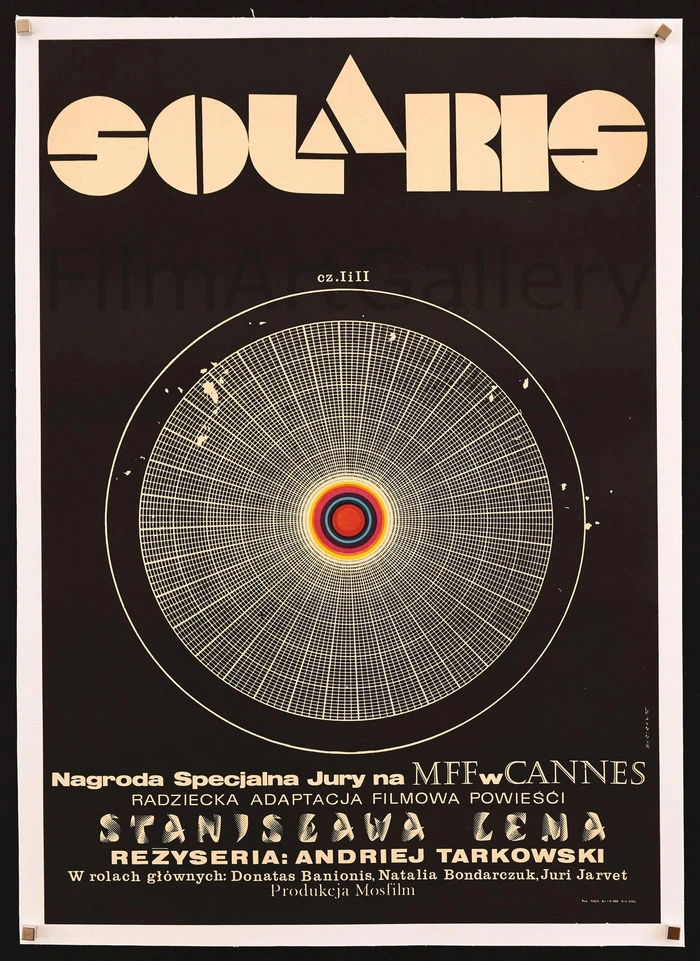
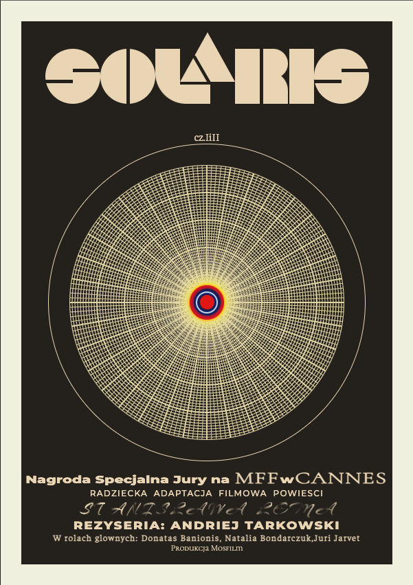

# Solaris

This code challenge was to replicate the retro movie poster for the film 'Solaris' using only plain html, css and js.

# To see it:

You can compare the brief to the result by seeing below, or opening `originalposter.webp` (...the original) and `result_screenshot.png` (the result of the challenge...). Alternatively if you have vs-code or similar with a `live server` extension, you can select the index.html and run that to view it in all it's glory in the browser.

## Comparison

<label> Original:  

</label>
<label> Result:  

</label>

